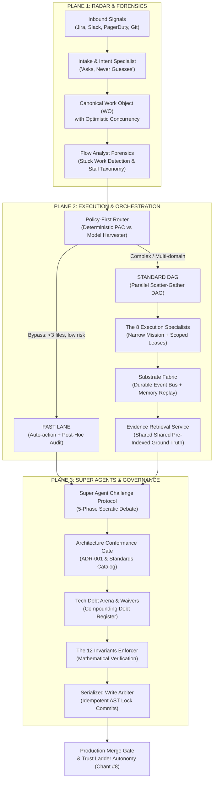

# PRIP-AI: Production Reasoning & Invariant Platform

> **An Agentic Reasoning, Evidence Service & Invariant Enforcement Architecture**  
> Fulfilling the 15-Section Comprehensive Blueprint for Autonomous Engineering Workflows.

---

## Architecture Overview

PRIP-AI operates across **Three Planes of Cognition and Governance**:



---

## Key Features

1. **Top-Level 2-Selection Operational Portal**:
   - **`[ 1. Interactive Animated Flowchart ]`**: Full animated pipeline visualization, route tracing (`Fast Lane`, `Standard DAG`, `Plane 3 Conflict`), multi-tenant project onboarding guide, and 1-click targeted runner.
   - **`[ 2. Running Application ]`**: 5-Stage sequential pipeline stepper with live metrics, telemetry, and interactive controls.
2. **Project-to-Project Scope & Multi-Tenancy**:
   - Switch active context dynamically across `checkout-service`, `billing-api`, `auth-gateway`, `inventory-service`, `legacy-reporting`, or custom onboarded repositories.
   - Dynamic project filtering across Stuck Work, Conformance PRs, Debt Challenges, and Audit Logs.
3. **Golden Set Test Runner (§13.6 & Chant #8)**:
   - "Treat prompts as code with tests. Regressions gate autonomy."
   - Runs test suites against golden assertions with regression delta tracking.
   - Automatically gates autonomy: drops down trust ladder upon regression.
4. **Resilience & Chaos Simulator**:
   - Interactive testing for Chant #8 Auto-Demotion, Write Arbiter AST collisions, Circuit Breaker P1 hard fallback, and Architecture Council Vetoes.
   - 1-click `[ Restore Baseline Health ]` recovery.
5. **The 12 Invariants Proof Hub**:
   - Formal verification against 12 core safety principles (Enclosure, Non-Overlapping Authority, Debt Budgeting, Idempotency, Serialized Writes, etc.).

---

## Service Endpoints & Ports

| Service | Port | Description |
| :--- | :--- | :--- |
| **Frontend UI (Cyber HUD)** | `http://localhost:6080` | React 18, Vite, Tailwind CSS, Lucide Icons |
| **Backend Engine API** | `http://localhost:6090` | FastAPI, Python 3.12, Uvicorn, 120 API routes |

---

## Quickstart

### Prerequisites
- Node.js 18+ and npm
- Python 3.10+
- Git

### 1. Start Backend Core
```bash
python -m uvicorn backend.main:app --host 0.0.0.0 --port 6090 --reload
```

### 2. Start Frontend HUD
```bash
cd frontend
npm install
npm run dev -- --port 6080 --host 0.0.0.0
```

### 3. Production Build
```bash
cd frontend
npm run build
```

---

## Reference Technology Posture (§13)

Positions, not products:
- **Model Gateway**: Model-agnostic abstraction layer with zero-downtime hot swapping.
- **Tool Protocol**: Standardized Model Context Protocol (MCP) tool registrations.
- **Event Bus**: Durable subscriptions, consumer offsets, and point-in-time event replay.
- **Work Object Store**: Optimistic concurrency locking with immutable version history.
- **GitOps Config**: Plays, manifests, and policy defined as code in version control.
- **Evaluation Harness**: Golden set testing per Play run on every prompt or agent iteration.
